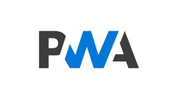

# Build a PWA app

<p style="text-align: center;">

</p>


## About

Une progressive web app (PWA, applications web progressives en français) est une application web qui consiste en des pages ou des sites web, et qui peuvent apparaître à l'utilisateur de la même manière que les applications natives ou les applications mobiles. Ce type d'applications tente de combiner les fonctionnalités offertes par la plupart des navigateurs modernes avec les avantages de l'expérience offerte par les appareils mobile.

Une PWA se consulte comme un site web classique, depuis une URL sécurisée mais permet une expérience utilisateur similaire à celle d'une application mobile, sans les contraintes de cette dernière (soumission aux App-Stores, utilisation importante de la mémoire de l'appareil…).

Elles proposent de conjuguer rapidité, fluidité et légèreté tout en permettant de limiter considérablement les coûts de développement : plus besoin de faire des développements spécifiques pour les applications en fonction de chacune des plateformes : iOS, Android…

## characteristics

1. Progressive 
1. Sécurisée 
1. Engageante
1. Installable 
1. Rapidité 
1. Optimisation pour le référencement 
1. Indépendante de la connexion 

## Requirements

* Manifest
   * Fichier Json pour définir les meta donnée de l'application web (exemple: nom, url de la page, liens vers les icones...)
* Service Worker
   * Script JavaScript permettant de fournir un proxy pour offrir une expérience utilisateur plus performante 
* Development tools
   * Console google Chrome
   * Lighthouse

## Build the app


1. Configure your working Space
    
    * work on localhost first 
    * We need to have an image for ours icons, an index.html, offline.html,style.css, offline.css
1. Dévelop the app
    
    * Create a online and offline version of your site or application
1. Manifest and icons, test it on your servor, then go to next step to build your app progressive

    * Follow instructions on [realfavicongenerator](https://realfavicongenerator.net/)
    * add this line on your manifest file :

    ```javascript
    "start_url": "index.html?utm_source=homescreen",
    ```

    You should have a manifest like this:
    ```javascript
    {
    "name": "AnnivTest",
    "short_name": "Anniv"
    "start_url": "index.html?utm_source=homescreen",
    "icons": [
        {
            "src": "/android-chrome-192x192.png",
            "sizes": "192x192",
            "type": "image/png"
        }
    ],
    "theme_color": "#ffffff",
    "background_color": "#ffffff",
    "display": "standalone"
}
    ```

1.  Service Worker  

    * Follow instructions on [talater.com/upup](https://www.talater.com/upup/getting-started-with-offline-first.html)
    * You should have this script on your index.html file:

```html
 <script src="/upup.min.js"></script>
<script>
  UpUp.start({
    'content-url': 'offline.html', // show this when the user is offline
    'assets': ['offline.css']
  });
</script>
```
1. Test your app with google Chrome console and lighthouse test

1. Deploy on http**s** url.

   Here the result [https://makemya.github.io/veille2/](https://makemya.github.io/veille2/)
